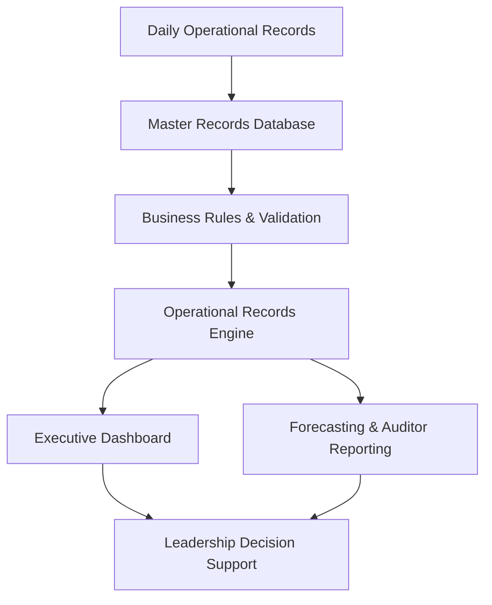
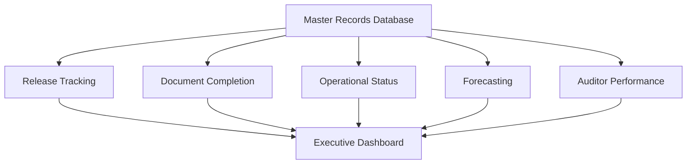

# BA-002-Enterprise-Records-Management-Compliance-System

> Business Analytics Portfolio Series

Designed and implemented a centralized operational records management platform that standardized document workflows, automated compliance tracking, improved executive reporting, and was successfully deployed across multiple detention facilities.

---

# 📊 Project Snapshot

| Category | Details |
|----------|---------|
| Role | Business Analyst / Solution Designer |
| Industry | Detention Operations |
| Primary Skill | Operations Management |
| Secondary Skills | Business Analysis, Process Improvement, Compliance Management |
| Primary Tools | Microsoft Excel, Advanced Excel Formulas, Dashboard Development |
| Project Type | Enterprise Operational Compliance Platform |
| Status | Production Implementation |
| Deployment | Alligator Alcatraz & Baker Correctional Institution |

---

# Executive Summary

---

# Operational Environment

---

# Business Problem

---

# Project Objectives

---

# Existing Process

---

# Solution Overview

---

## Solution Workflow

---

# System Architecture

---

# Core System Modules

### Master Records Database

---

### Executive Dashboard

---

### Forecasting Engine

---

### Auditor Performance Reporting

---

### Operational Metrics

---

### Compliance Tracking

---

# Business Rules & Validation

---

# Dashboard & Executive Reporting

---

# Forecasting & Workforce Planning

---

# Operational Compliance Controls

---

# Multi-Facility Deployment

## Initial Implementation

### Alligator Alcatraz

---

## Standardization

Documented operational workflows that could be reproduced across facilities with minimal configuration.

---

## Secondary Deployment

### Baker Correctional Institution

Successfully recreated the operational records management platform using the same architecture and reporting methodology.

---

# Technologies Used

- Microsoft Excel
- Structured Tables
- Advanced Excel Formulas
- COUNTIF / COUNTIFS
- SUMIFS
- IF / Nested IF Logic
- Conditional Formatting
- Data Validation
- Dashboard Design
- Forecast Modeling
- KPI Reporting
- Executive Reporting

---

# Key Features

---

# Results

---

# Leadership Value

---

# Screenshots

## Executive Dashboard

*(Coming Soon)*

---

## Master Records Database

*(Coming Soon)*

---

## Forecasting Dashboard

*(Coming Soon)*

---

## Auditor Performance Reporting

*(Coming Soon)*

---

## Operational Metrics

*(Coming Soon)*

---

## Formula Examples

*(Coming Soon)*

---

# Lessons Learned

---

# Future Enhancements

---

# Related Projects

- BA-001 | Workforce Planning & Scheduling System
