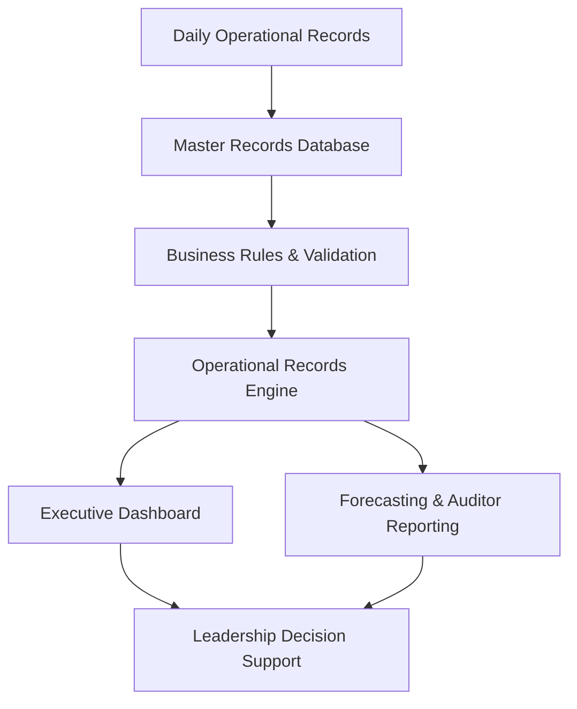
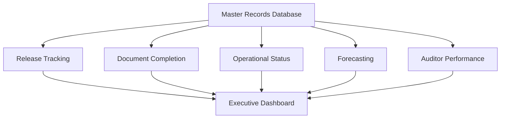
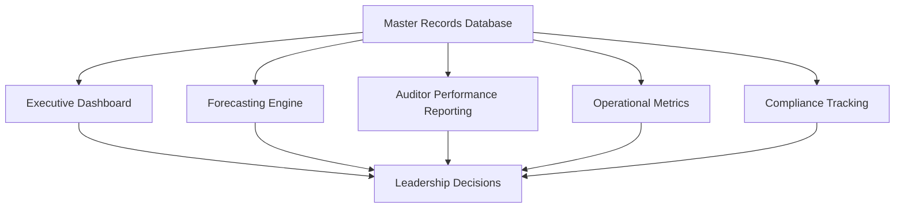
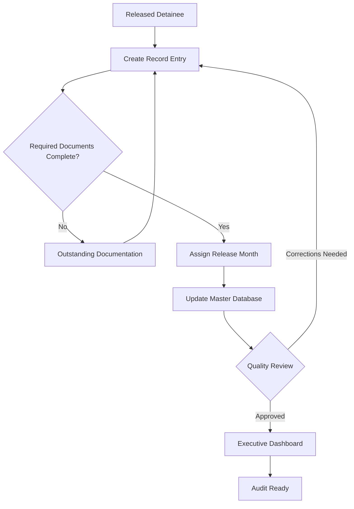
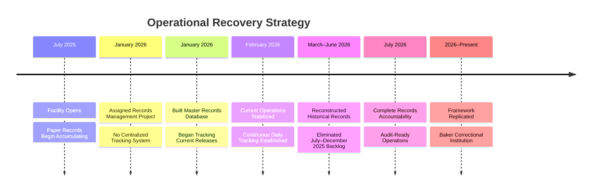

# BA-002-Enterprise-Records-Management-Compliance-System

> Business Analytics Portfolio Series

Designed and implemented a centralized operational records management platform that standardized document workflows, automated compliance tracking, improved executive reporting, and was successfully deployed across multiple detention facilities.

---

# 📊 Project Snapshot

| Category | Details |
|----------|---------|
| Role | Business Analyst / Solution Designer |
| Industry | Detention Operations |
| Primary Skill | Operations Management |
| Secondary Skills | Business Analysis, Compliance Management, Process Improvement |
| Primary Tools | Microsoft Excel, Advanced Excel Formulas, Dashboard Development |
| Project Type | Enterprise Operational Compliance Platform |
| Status | Production Implementation |
| Facilities | Alligator Alcatraz & Baker Correctional Institution |
| Records Processed | 28,200+ Detainee Records |
| Initial Deployment | July 2025 |

---

# Executive Summary

Designed and implemented a centralized operational records management and compliance platform to standardize detainee records processing, automate operational reporting, and improve executive visibility across detention operations.

The system was first implemented at **Alligator Alcatraz**, where it supported the processing and management of approximately **20,000 detainee records** between **July 2025 and June 2026**. Following its success, the platform was recreated and deployed at **Baker Correctional Institution**, where it has processed more than **8,200 detainee records** and continues to support daily operations.

The solution centralized operational records, automated completion tracking, provided executive dashboards, monitored auditor productivity, forecasted workload, and standardized reporting processes across multiple facilities.

---

# Operational Environment

The Enterprise Records Management & Operational Compliance Platform supported high-volume detention operations responsible for processing detainee records in a fast-paced, compliance-driven environment.

The operational records team managed the creation, review, and completion of release documentation while coordinating with multiple internal departments to ensure records met facility and contractual requirements before release.

The platform was implemented in two production detention facilities:

- **Alligator Alcatraz** (July 2025 – June 2026)
  - Approximately **20,000 detainee records** processed.

- **Baker Correctional Institution** (Current)
  - More than **8,200 detainee records** processed to date.

The solution provided leadership with centralized operational visibility into record completion, workload forecasting, auditor productivity, and overall operational readiness.

---

# Business Problem

When this project began in **January 2026**, the detention facility had already been operating for approximately six months (since July 2025). During that time, no centralized records management system had been established.

Operational records existed only as physical paper files organized into stacks by anticipated release date. There was no searchable database, no standardized workflow, and no reliable method to monitor document completion, operational progress, or overall records accountability.

At the same time, facility leadership knew an external audit was expected but had not been given a scheduled date. Without a centralized records system, there was no practical way to quickly demonstrate records accountability or operational readiness if an audit occurred.

Leadership needed a solution that would establish immediate operational control while allowing historical records to be reconciled over time.

The challenge was not simply creating a database—it was implementing a sustainable operational process while simultaneously addressing a growing backlog of historical records.

---

# Project Objectives

The objective of this project was not simply to digitize records, but to establish a scalable operational records management platform capable of supporting daily operations, executive oversight, and future compliance audits.

Primary objectives included:

- Establish a centralized detainee records database.
- Maintain real-time accountability for all released detainee records.
- Standardize document indexing and filing procedures.
- Reduce the time required to locate records.
- Provide leadership with operational visibility through dashboards and reporting.
- Prepare the facility for future compliance audits.
- Create a repeatable monthly workflow that prevented future record backlogs.
- Design a standardized system capable of deployment at additional detention facilities.
- Eliminate the possibility of future backlog accumulation by embedding records management into daily operations.

---

# Existing Process

When responsibility for detainee records management was assigned to me in January 2026, no centralized tracking or accountability system existed.

Since the facility opened in July 2025, released detainee records had been maintained as physical paper files grouped only by release date. While records were available, there was no searchable database, standardized tracking process, or operational reporting capability.

As record volume increased, locating files became increasingly time-consuming and leadership had limited visibility into overall progress or document accountability.

Operational limitations included:

- Paper records organized only by release date.
- No centralized records database.
- No standardized document indexing.
- No reporting for workload or completion status.
- No method to quickly retrieve detainee records.
- No audit readiness tracking.
- No executive visibility into records operations.

The process depended almost entirely on manual searching and institutional knowledge, making long-term records accountability difficult as the detainee population continued to grow.

---

# Key Business Decisions

The design of the Enterprise Records Management & Operational Compliance Platform was driven by operational risk, scalability, and long-term sustainability rather than simply organizing historical records.

## Decision 1 — Prioritize Current Operations

### Challenge

The facility had accumulated approximately six months of historical paper records before a centralized tracking system existed.

At the same time, leadership expected an external audit at an unknown date while daily operational records continued to increase.

### Options Considered

**Option A**

- Organize historical records first.
- Delay implementation until backlog was complete.

**Advantages**

- Historical records completed first.

**Disadvantages**

- Current operational records would continue growing.
- Increased risk of falling further behind.
- Greater exposure if an audit occurred unexpectedly.

---

**Option B (Selected)**

- Implement the records management platform immediately for all current operations.
- Keep current-year records continuously up to date.
- Eliminate the historical backlog after operational stability was achieved.

### Business Rationale

This approach minimized operational risk by ensuring every new detainee record entering the system was immediately tracked while preventing the backlog from continuing to grow.

Once current operations were stabilized, historical records dating back to July 2025 were systematically entered until full accountability was achieved.

**Outcome**

- Immediate operational control established.
- Audit readiness significantly improved.
- Historical backlog eliminated without interrupting daily operations.

---

## Decision 2 — Design for Operational Simplicity

Rather than maintaining a single continuously growing worksheet, the records management platform was organized into individual monthly operational databases.

Each operational month contained its own standardized records worksheet while maintaining the same structure, formulas, reporting logic, and workflow.

### Business Rationale

This design made the system easier for both leadership and operational staff to navigate by:

- Reducing visual complexity.
- Allowing staff to focus only on the current month's workload.
- Preserving completed months as historical operational records.
- Simplifying monthly reporting and audit preparation.
- Providing a consistent structure that could be replicated each month.

Because every monthly database followed the same architecture, new operational periods could be created quickly without redesigning the system, providing a standardized framework for long-term records management.

---

## Decision 3 — Design for Reuse Across Facilities

The overall architecture was intentionally standardized so the operational framework could be recreated at additional detention facilities.

This design approach later enabled successful implementation at Baker Correctional Institution using the same operational methodology.

---

# Implementation Strategy

Rather than attempting to organize six months of historical paper records before deploying the system, I prioritized operational risk.

The implementation strategy focused on establishing the records management platform for **current-year operations (January 2026 forward)** so that all new detainee records entering the system were immediately tracked using standardized workflows.

This approach ensured the facility remained current with all active releases while creating a stable operational process that would withstand an unexpected audit.

Once daily operations were under control, historical detainee records dating back to the facility's opening in **July 2025** were systematically reviewed and entered into the platform until the historical backlog was fully reconciled through **December 2025**.

This phased implementation allowed the organization to:

- Establish immediate operational accountability.
- Maintain current-year compliance.
- Reduce audit risk.
- Continue daily operations without interruption.
- Gradually eliminate the historical records backlog while preserving ongoing operational readiness.

---

# Solution Overview

---

## Solution Workflow

---

# System Architecture

---

# Core System Modules

---

# Business Rules & Validation

The records management system enforced a standardized workflow to ensure document accountability, operational consistency, and audit readiness across the facility.

Each detainee record progressed through a series of validation checkpoints before being considered complete.

### Primary Business Rules

- Every released detainee required a master record.
- Records were not considered complete until all required documentation was accounted for.
- Every record was assigned to its operational release month.
- Duplicate records were prohibited.
- Executive dashboards only reported validated records.
- All validated records remained searchable to support future audits.

---

## Validation Rules

The database included multiple validation checkpoints to maintain data quality.

| Validation | Purpose |
|------------|---------|
| Required Documents | Prevent incomplete record closure |
| Duplicate Check | Prevent duplicate detainee records |
| Release Date Validation | Ensure correct monthly assignment |
| Completion Status | Track outstanding work |
| Auditor Assignment | Identify responsibility for processing |
| Monthly Rollup | Support executive reporting |
| Dashboard Metrics | Generate operational KPIs |
| Audit Readiness | Confirm record availability during inspections |

---

## Why These Rules Mattered

Rather than serving as a simple filing log, the records management system functioned as an operational control mechanism.

These validation rules ensured that:

- leadership always had an accurate picture of operational progress,
- auditors could quickly locate required documentation,
- incomplete records remained visible until resolved,
- duplicate work was minimized, and
- the facility maintained continuous audit readiness.

---

# Operational Recovery Strategy

Rather than attempting to reconstruct six months of historical records immediately, I adopted a phased implementation strategy focused on reducing operational risk.

The first priority was preventing the backlog from continuing to grow. I implemented the records management system for current operations beginning in January 2026, ensuring that every new detainee release was tracked in real time and that the facility would remain audit-ready moving forward.

Once current operations had stabilized, I shifted focus to reconstructing historical records from the facility's opening in July 2025 through December 2025. This phased approach allowed day-to-day operations to continue uninterrupted while systematically eliminating the historical backlog.

By completing both phases, the facility achieved complete detainee records accountability and established a sustainable operational process that was later replicated at Baker Correctional Institution.

## Strategic Outcome

This phased recovery strategy achieved several critical operational objectives:

- Prevented the historical backlog from continuing to grow.
- Established continuous records accountability for all new releases.
- Enabled audit readiness while historical records were reconstructed.
- Reduced operational risk by prioritizing current-year compliance.
- Successfully recovered more than 20,000 detainee records at Alligator Alcatraz.
- Created a standardized framework later deployed at Baker Correctional Institution, where it continues to support records operations.

---

### Executive Dashboard

The Executive Dashboard provided leadership with a real-time operational summary of detainee records processing, completion status, workload distribution, and overall compliance progress.

**Purpose**

Provides leadership with a real-time overview of detainee records operations, production metrics, and compliance status.

**Business Value**

- Executive visibility
- Operational awareness
- Audit readiness
- Decision support

---

### Master Records Database

The centralized operational database served as the authoritative source for all released detainee records.

Every operational dashboard, report, and compliance metric was generated from this dataset.

---

### Monthly Workbook Structure

Records were organized into monthly operational workbooks, simplifying navigation for auditors, supervisors, and leadership while maintaining a consistent structure throughout the year.

### Auditor Performance Reporting

Individual productivity reporting enabled supervisors to monitor workload distribution, completion rates, and overall processing performance.

---

### Operational Metrics

Generated operational KPIs including records processed, backlog status, monthly completion rates, average processing times, and overall facility progress.

---

### Formula Examples

# Completion Percentage

# Status 

# Conditional Formatting Rules

# Data Validation

---

### Compliance Tracking

Maintained accountability for required documentation, identified missing records, monitored audit readiness, and ensured every released detainee record could be located quickly.

---

### Multi-Facility Deployment

Following successful implementation at Alligator Alcatraz, the records management framework was adopted at Baker Correctional Institution with only minor operational adjustments, demonstrating the portability and scalability of the system design.

## Initial Implementation

### Alligator Alcatraz

- Designed and implemented the original operational records management platform.
- Supported approximately **20,000 detainee records** between **July 2025 and June 2026**.
- Standardized records processing and compliance reporting.
- Improved operational visibility through executive dashboards and KPI reporting.
  
---

## Standardization

Documented operational workflows that could be reproduced across facilities with minimal configuration.

---

## Secondary Deployment

### Baker Correctional Institution

- Successfully recreated and deployed the same operational records management platform.
- Adapted the solution to support local operational requirements while maintaining standardized workflows.
- Currently supports ongoing operations with more than **8,200 detainee records** processed.

---
## Organizational Impact

The platform established a standardized operational records framework that could be consistently implemented across multiple detention facilities, improving reporting consistency, operational visibility, and compliance monitoring.

---

# Technologies Used

- Microsoft Excel
- Structured Tables
- Advanced Excel Formulas
- COUNTIF / COUNTIFS
- SUMIFS
- IF / Nested IF Logic
- Conditional Formatting
- Data Validation
- Dashboard Design
- Forecast Modeling
- KPI Reporting
- Executive Reporting

---

# Key Features

The Enterprise Records Management & Compliance System transformed a paper-based records process into a standardized operational platform supporting compliance, executive reporting, and long-term records accountability.

## Operational Features

- Centralized master database for released detainee records.
- Standardized monthly records tracking structure.
- Searchable records index for rapid document retrieval.
- Monthly workbook architecture for simplified navigation.
- Automated operational metrics and workload summaries.
- Executive dashboards providing real-time operational visibility.
- Auditor productivity reporting.
- Compliance tracking and audit readiness monitoring.
- Historical records accountability from July 2025 onward.
- Replicable deployment framework used at multiple detention facilities.

## Management Features

- Monthly workload forecasting.
- Completion status monitoring.
- Outstanding records identification.
- Executive KPI reporting.
- Auditor performance monitoring.
- Operational trend analysis.
- Monthly production reporting.
- Historical audit support.

## Technical Features

- Advanced Excel formulas for automated reporting.
- Dynamic dashboards using Pivot Tables and Pivot Charts.
- Cross-sheet data validation.
- Standardized workbook templates.
- Structured monthly database architecture.
- Designed for rapid deployment without additional software.

---

# Results

The records management system became the operational standard for detainee records accountability and significantly improved visibility, organization, and audit readiness.

## Operational Outcomes

- Successfully accounted for more than **20,000 detainee records** at Alligator Alcatraz.
- Currently supports more than **8,200 detainee records** at Baker Correctional Institution.
- Eliminated reliance on paper-only record tracking.
- Established continuous records accountability for all new detainee releases.
- Successfully reconstructed historical records dating back to facility opening.
- Standardized monthly records organization across operations.

## Leadership Benefits

- Improved executive visibility into records operations.
- Enabled workload forecasting and staffing awareness.
- Reduced time required to locate detainee records.
- Supported compliance inspections and audit preparation.
- Provided standardized operational reporting for leadership.

## Organizational Impact

The success of the records management framework demonstrated that the operational design could be standardized beyond a single facility.

Following successful implementation at Alligator Alcatraz, the same framework was adopted at **Baker Correctional Institution**, where it continues to support ongoing detainee records operations.

The project evolved from a local records tracking solution into a repeatable operational framework capable of supporting multiple detention facilities while maintaining consistent reporting, document accountability, and compliance standards.

---

## Project Impact

- Designed and implemented an enterprise records management system from the ground up.
- Recovered and organized more than 20,000 historical detainee records.
- Established continuous audit-ready operations beginning January 2026.
- Created a standardized operational framework later deployed at a second correctional facility.
- Improved executive visibility through centralized reporting and operational dashboards.

---

### Operational Scale

- Supported the management of more than **28,200 detainee records** across two detention facilities.
- Successfully deployed in multiple production environments.
- Standardized operational records workflows across facilities.

### Process Improvements

- Centralized operational records into a single management platform.
- Automated completion tracking for required documentation.
- Improved visibility into operational performance through executive dashboards.
- Standardized compliance reporting across departments.
- Increased accountability through auditor performance reporting.

### Leadership Value

- Provided real-time operational metrics.
- Supported workload forecasting and planning.
- Improved management oversight through centralized KPI reporting.
- Enabled leadership to quickly identify documentation gaps and operational bottlenecks.

---

# Screenshots

## Executive Dashboard

*(Coming Soon)*

---

## Master Records Database

*(Coming Soon)*

---

## Forecasting Dashboard

*(Coming Soon)*

---

## Auditor Performance Reporting

*(Coming Soon)*

---

## Operational Metrics

*(Coming Soon)*

---

## Formula Examples

*(Coming Soon)*

---

# What I'd Do Differently Today

The Excel-based architecture successfully met the operational requirements of two active detention facilities and enabled rapid deployment without requiring additional software licensing or infrastructure.

If I were designing this solution today, I would transition the platform to a cloud-based architecture to improve scalability, automation, and long-term maintainability.

### Modern Architecture

- Migrate the master records database to **Microsoft SQL Server** or **Microsoft Dataverse**.
- Replace Excel reporting with interactive **Power BI** executive dashboards.
- Automate document ingestion and workflow notifications using **Microsoft Power Automate**.
- Implement role-based security and centralized access management.
- Enable real-time collaboration without maintaining multiple workbook versions.
- Build audit history and document versioning directly into the platform.

### Why Excel Was the Right Choice

At the time of implementation, Excel provided the fastest path to delivering an operational solution under immediate business constraints. The system successfully:

- Accounted for more than **20,000 detainee records** at Alligator Alcatraz.
- Was replicated and successfully deployed at **Baker Correctional Institution**.
- Eliminated manual records tracking.
- Supported operational reporting and audit readiness.
- Required no additional software purchases or infrastructure changes.

While a modern cloud-based solution would offer greater scalability, the Excel-based platform achieved its primary objective: rapidly delivering a reliable operational records management system that became the standard across multiple facilities.

---

# Future Enhancements

---

# Project Reflection

This project reinforced that successful business solutions are not defined by the technology used, but by how effectively they solve operational problems.

Rather than beginning with software selection, I focused on understanding the operational workflow, identifying the highest business risk, and designing a process that staff could realistically adopt. The technology supported the process—not the other way around.

The experience also demonstrated the value of building solutions that can be standardized and replicated. After proving successful at Alligator Alcatraz, the same records management framework was deployed at Baker Correctional Institution with minimal modification.

# Related Projects

- BA-001 | Workforce Planning & Scheduling System
