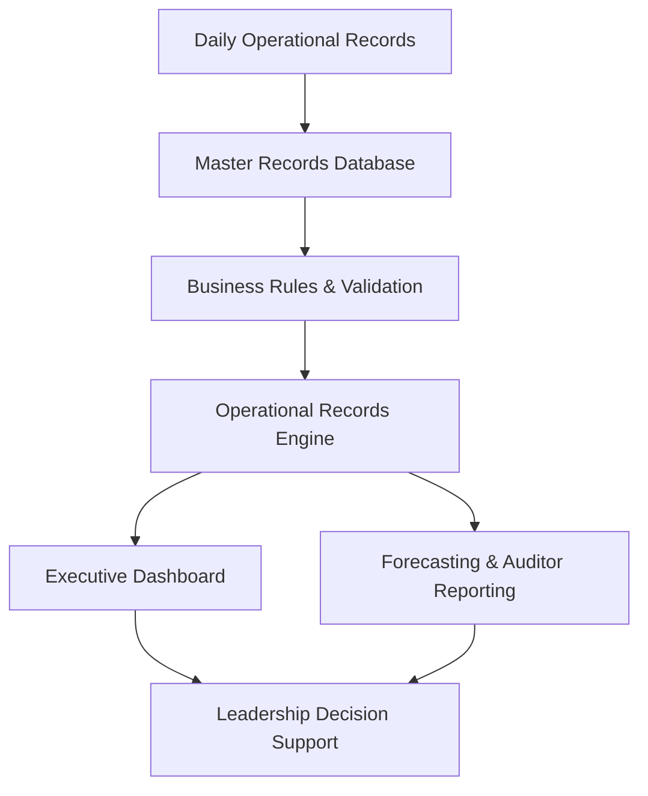
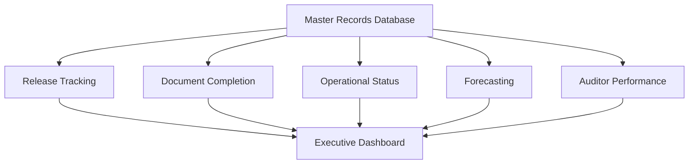

# BA-002-Enterprise-Records-Management-Compliance-System

> Business Analytics Portfolio Series

Designed and implemented a centralized operational records management platform that standardized document workflows, automated compliance tracking, improved executive reporting, and was successfully deployed across multiple detention facilities.

---

# 📊 Project Snapshot

| Category | Details |
|----------|---------|
| Role | Business Analyst / Solution Designer |
| Industry | Detention Operations |
| Primary Skill | Operations Management |
| Secondary Skills | Business Analysis, Compliance Management, Process Improvement |
| Primary Tools | Microsoft Excel, Advanced Excel Formulas, Dashboard Development |
| Project Type | Enterprise Operational Compliance Platform |
| Status | Production Implementation |
| Facilities | Alligator Alcatraz & Baker Correctional Institution |
| Records Processed | 28,200+ Detainee Records |
| Initial Deployment | July 2025 |

---

# Executive Summary

Designed and implemented a centralized operational records management and compliance platform to standardize detainee records processing, automate operational reporting, and improve executive visibility across detention operations.

The system was first implemented at **Alligator Alcatraz**, where it supported the processing and management of approximately **20,000 detainee records** between **July 2025 and June 2026**. Following its success, the platform was recreated and deployed at **Baker Correctional Institution**, where it has processed more than **8,200 detainee records** and continues to support daily operations.

The solution centralized operational records, automated completion tracking, provided executive dashboards, monitored auditor productivity, forecasted workload, and standardized reporting processes across multiple facilities.

---

# Operational Environment

---

# Business Problem

---

# Project Objectives

---

# Existing Process

---

# Solution Overview

---

## Solution Workflow

---

# System Architecture

---

# Core System Modules

### Master Records Database

---

### Executive Dashboard

---

### Forecasting Engine

---

### Auditor Performance Reporting

---

### Operational Metrics

---

### Compliance Tracking

---

# Business Rules & Validation

---

# Dashboard & Executive Reporting

---

# Forecasting & Workforce Planning

---

# Operational Compliance Controls

---

# Multi-Facility Deployment

## Initial Implementation

### Alligator Alcatraz

- Designed and implemented the original operational records management platform.
- Supported approximately **20,000 detainee records** between **July 2025 and June 2026**.
- Standardized records processing and compliance reporting.
- Improved operational visibility through executive dashboards and KPI reporting.
  
---

## Standardization

Documented operational workflows that could be reproduced across facilities with minimal configuration.

---

## Secondary Deployment

### Baker Correctional Institution

- Successfully recreated and deployed the same operational records management platform.
- Adapted the solution to support local operational requirements while maintaining standardized workflows.
- Currently supports ongoing operations with more than **8,200 detainee records** processed.

---
## Organizational Impact

The platform established a standardized operational records framework that could be consistently implemented across multiple detention facilities, improving reporting consistency, operational visibility, and compliance monitoring.

---

# Technologies Used

- Microsoft Excel
- Structured Tables
- Advanced Excel Formulas
- COUNTIF / COUNTIFS
- SUMIFS
- IF / Nested IF Logic
- Conditional Formatting
- Data Validation
- Dashboard Design
- Forecast Modeling
- KPI Reporting
- Executive Reporting

---

# Key Features

---

# Results

---

# Business Impact

The Enterprise Records Management & Operational Compliance Platform produced measurable operational improvements.

### Operational Scale

- Supported the management of more than **28,200 detainee records** across two detention facilities.
- Successfully deployed in multiple production environments.
- Standardized operational records workflows across facilities.

### Process Improvements

- Centralized operational records into a single management platform.
- Automated completion tracking for required documentation.
- Improved visibility into operational performance through executive dashboards.
- Standardized compliance reporting across departments.
- Increased accountability through auditor performance reporting.

### Leadership Value

- Provided real-time operational metrics.
- Supported workload forecasting and planning.
- Improved management oversight through centralized KPI reporting.
- Enabled leadership to quickly identify documentation gaps and operational bottlenecks.

---

# Screenshots

## Executive Dashboard

*(Coming Soon)*

---

## Master Records Database

*(Coming Soon)*

---

## Forecasting Dashboard

*(Coming Soon)*

---

## Auditor Performance Reporting

*(Coming Soon)*

---

## Operational Metrics

*(Coming Soon)*

---

## Formula Examples

*(Coming Soon)*

---

# Lessons Learned

---

# Future Enhancements

---

# Related Projects

- BA-001 | Workforce Planning & Scheduling System
