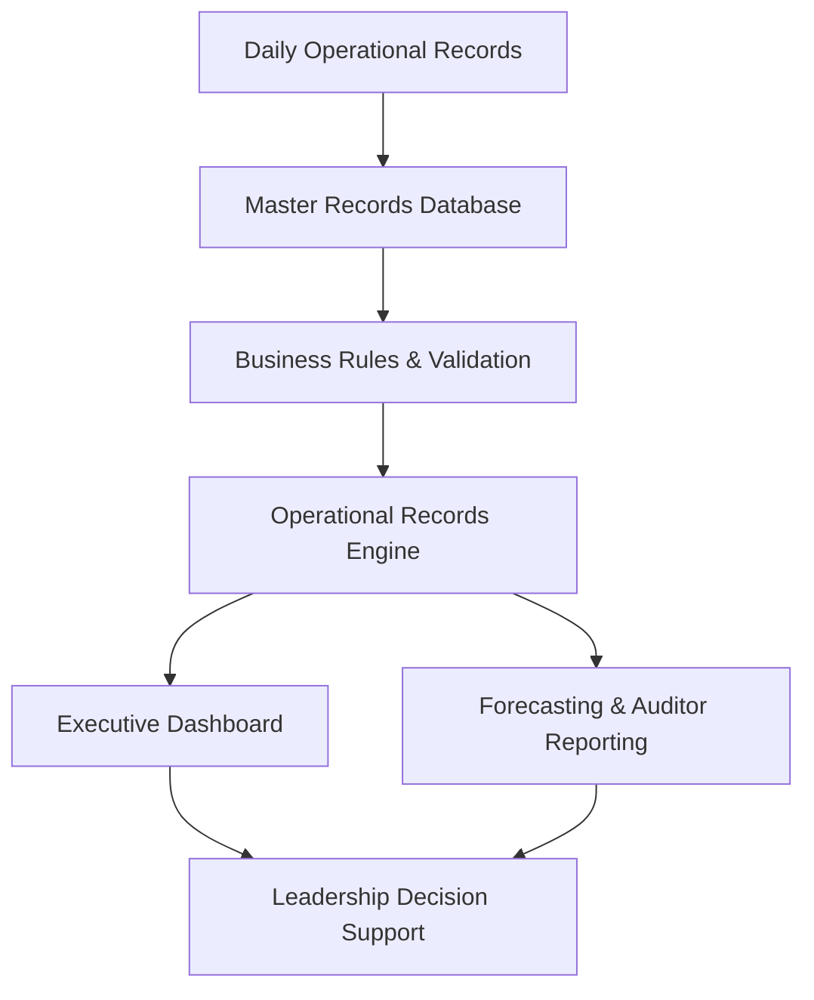
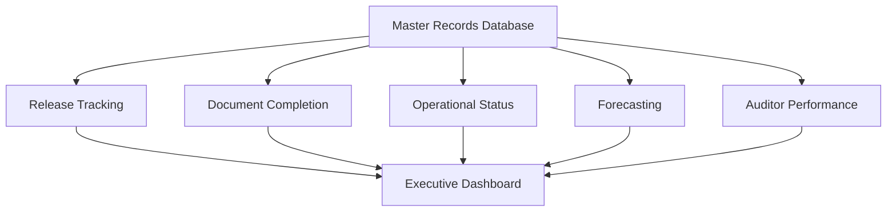

# BA-002-Enterprise-Records-Management-Compliance-System

> Business Analytics Portfolio Series

Designed and implemented a centralized operational records management platform that standardized document workflows, automated compliance tracking, improved executive reporting, and was successfully deployed across multiple detention facilities.

---

# 📊 Project Snapshot

| Category | Details |
|----------|---------|
| Role | Business Analyst / Solution Designer |
| Industry | Detention Operations |
| Primary Skill | Operations Management |
| Secondary Skills | Business Analysis, Compliance Management, Process Improvement |
| Primary Tools | Microsoft Excel, Advanced Excel Formulas, Dashboard Development |
| Project Type | Enterprise Operational Compliance Platform |
| Status | Production Implementation |
| Facilities | Alligator Alcatraz & Baker Correctional Institution |
| Records Processed | 28,200+ Detainee Records |
| Initial Deployment | July 2025 |

---

# Executive Summary

Designed and implemented a centralized operational records management and compliance platform to standardize detainee records processing, automate operational reporting, and improve executive visibility across detention operations.

The system was first implemented at **Alligator Alcatraz**, where it supported the processing and management of approximately **20,000 detainee records** between **July 2025 and June 2026**. Following its success, the platform was recreated and deployed at **Baker Correctional Institution**, where it has processed more than **8,200 detainee records** and continues to support daily operations.

The solution centralized operational records, automated completion tracking, provided executive dashboards, monitored auditor productivity, forecasted workload, and standardized reporting processes across multiple facilities.

---

# Operational Environment

The Enterprise Records Management & Operational Compliance Platform supported high-volume detention operations responsible for processing detainee records in a fast-paced, compliance-driven environment.

The operational records team managed the creation, review, and completion of release documentation while coordinating with multiple internal departments to ensure records met facility and contractual requirements before release.

The platform was implemented in two production detention facilities:

- **Alligator Alcatraz** (July 2025 – June 2026)
  - Approximately **20,000 detainee records** processed.

- **Baker Correctional Institution** (Current)
  - More than **8,200 detainee records** processed to date.

The solution provided leadership with centralized operational visibility into record completion, workload forecasting, auditor productivity, and overall operational readiness.

---

# Business Problem

When this project began in **January 2026**, the detention facility had already been operating for approximately six months (since July 2025). During that time, no centralized records management system had been established.

Operational records existed only as physical paper files organized into stacks by anticipated release date. There was no searchable database, no standardized workflow, and no reliable method to monitor document completion, operational progress, or overall records accountability.

At the same time, facility leadership knew an external audit was expected but had not been given a scheduled date. Without a centralized records system, there was no practical way to quickly demonstrate records accountability or operational readiness if an audit occurred.

Leadership needed a solution that would establish immediate operational control while allowing historical records to be reconciled over time.

The challenge was not simply creating a database—it was implementing a sustainable operational process while simultaneously addressing a growing backlog of historical records.

---

# Project Objectives

The objective of this project was not simply to digitize records, but to establish a scalable operational records management platform capable of supporting daily operations, executive oversight, and future compliance audits.

Primary objectives included:

- Establish a centralized detainee records database.
- Maintain real-time accountability for all released detainee records.
- Standardize document indexing and filing procedures.
- Reduce the time required to locate records.
- Provide leadership with operational visibility through dashboards and reporting.
- Prepare the facility for future compliance audits.
- Create a repeatable monthly workflow that prevented future record backlogs.
- Design a standardized system capable of deployment at additional detention facilities.
- Eliminate the possibility of future backlog accumulation by embedding records management into daily operations.

---

# Existing Process

When responsibility for detainee records management was assigned to me in January 2026, no centralized tracking or accountability system existed.

Since the facility opened in July 2025, released detainee records had been maintained as physical paper files grouped only by release date. While records were available, there was no searchable database, standardized tracking process, or operational reporting capability.

As record volume increased, locating files became increasingly time-consuming and leadership had limited visibility into overall progress or document accountability.

Operational limitations included:

- Paper records organized only by release date.
- No centralized records database.
- No standardized document indexing.
- No reporting for workload or completion status.
- No method to quickly retrieve detainee records.
- No audit readiness tracking.
- No executive visibility into records operations.

The process depended almost entirely on manual searching and institutional knowledge, making long-term records accountability difficult as the detainee population continued to grow.

---

# Key Business Decisions

The design of the Enterprise Records Management & Operational Compliance Platform was driven by operational risk, scalability, and long-term sustainability rather than simply organizing historical records.

## Decision 1 — Prioritize Current Operations

### Challenge

The facility had accumulated approximately six months of historical paper records before a centralized tracking system existed.

At the same time, leadership expected an external audit at an unknown date while daily operational records continued to increase.

### Options Considered

**Option A**

- Organize historical records first.
- Delay implementation until backlog was complete.

**Advantages**

- Historical records completed first.

**Disadvantages**

- Current operational records would continue growing.
- Increased risk of falling further behind.
- Greater exposure if an audit occurred unexpectedly.

---

**Option B (Selected)**

- Implement the records management platform immediately for all current operations.
- Keep current-year records continuously up to date.
- Eliminate the historical backlog after operational stability was achieved.

### Business Rationale

This approach minimized operational risk by ensuring every new detainee record entering the system was immediately tracked while preventing the backlog from continuing to grow.

Once current operations were stabilized, historical records dating back to July 2025 were systematically entered until full accountability was achieved.

**Outcome**

- Immediate operational control established.
- Audit readiness significantly improved.
- Historical backlog eliminated without interrupting daily operations.

---

## Decision 2 — Design for Operational Simplicity

Rather than maintaining a single continuously growing worksheet, the records management platform was organized into individual monthly operational databases.

Each operational month contained its own standardized records worksheet while maintaining the same structure, formulas, reporting logic, and workflow.

### Business Rationale

This design made the system easier for both leadership and operational staff to navigate by:

- Reducing visual complexity.
- Allowing staff to focus only on the current month's workload.
- Preserving completed months as historical operational records.
- Simplifying monthly reporting and audit preparation.
- Providing a consistent structure that could be replicated each month.

Because every monthly database followed the same architecture, new operational periods could be created quickly without redesigning the system, providing a standardized framework for long-term records management.

---

## Decision 3 — Design for Reuse Across Facilities

The overall architecture was intentionally standardized so the operational framework could be recreated at additional detention facilities.

This design approach later enabled successful implementation at Baker Correctional Institution using the same operational methodology.

# Implementation Strategy

Rather than attempting to organize six months of historical paper records before deploying the system, I prioritized operational risk.

The implementation strategy focused on establishing the records management platform for **current-year operations (January 2026 forward)** so that all new detainee records entering the system were immediately tracked using standardized workflows.

This approach ensured the facility remained current with all active releases while creating a stable operational process that would withstand an unexpected audit.

Once daily operations were under control, historical detainee records dating back to the facility's opening in **July 2025** were systematically reviewed and entered into the platform until the historical backlog was fully reconciled through **December 2025**.

This phased implementation allowed the organization to:

- Establish immediate operational accountability.
- Maintain current-year compliance.
- Reduce audit risk.
- Continue daily operations without interruption.
- Gradually eliminate the historical records backlog while preserving ongoing operational readiness.

---

# Solution Overview

---

## Solution Workflow

---

# System Architecture

---

# Core System Modules

### Master Records Database

---

### Executive Dashboard

---

### Forecasting Engine

---

### Auditor Performance Reporting

---

### Operational Metrics

---

### Compliance Tracking

---

# Business Rules & Validation

---

# Dashboard & Executive Reporting

---

# Forecasting & Workforce Planning

---

# Operational Compliance Controls

---

# Multi-Facility Deployment

## Initial Implementation

### Alligator Alcatraz

- Designed and implemented the original operational records management platform.
- Supported approximately **20,000 detainee records** between **July 2025 and June 2026**.
- Standardized records processing and compliance reporting.
- Improved operational visibility through executive dashboards and KPI reporting.
  
---

## Standardization

Documented operational workflows that could be reproduced across facilities with minimal configuration.

---

## Secondary Deployment

### Baker Correctional Institution

- Successfully recreated and deployed the same operational records management platform.
- Adapted the solution to support local operational requirements while maintaining standardized workflows.
- Currently supports ongoing operations with more than **8,200 detainee records** processed.

---
## Organizational Impact

The platform established a standardized operational records framework that could be consistently implemented across multiple detention facilities, improving reporting consistency, operational visibility, and compliance monitoring.

---

# Technologies Used

- Microsoft Excel
- Structured Tables
- Advanced Excel Formulas
- COUNTIF / COUNTIFS
- SUMIFS
- IF / Nested IF Logic
- Conditional Formatting
- Data Validation
- Dashboard Design
- Forecast Modeling
- KPI Reporting
- Executive Reporting

---

# Key Features

---

# Results

---

# Business Impact

The Enterprise Records Management & Operational Compliance Platform produced measurable operational improvements.

### Operational Scale

- Supported the management of more than **28,200 detainee records** across two detention facilities.
- Successfully deployed in multiple production environments.
- Standardized operational records workflows across facilities.

### Process Improvements

- Centralized operational records into a single management platform.
- Automated completion tracking for required documentation.
- Improved visibility into operational performance through executive dashboards.
- Standardized compliance reporting across departments.
- Increased accountability through auditor performance reporting.

### Leadership Value

- Provided real-time operational metrics.
- Supported workload forecasting and planning.
- Improved management oversight through centralized KPI reporting.
- Enabled leadership to quickly identify documentation gaps and operational bottlenecks.

---

# Screenshots

## Executive Dashboard

*(Coming Soon)*

---

## Master Records Database

*(Coming Soon)*

---

## Forecasting Dashboard

*(Coming Soon)*

---

## Auditor Performance Reporting

*(Coming Soon)*

---

## Operational Metrics

*(Coming Soon)*

---

## Formula Examples

*(Coming Soon)*

---

# Lessons Learned

---

# Future Enhancements

---

# Related Projects

- BA-001 | Workforce Planning & Scheduling System
