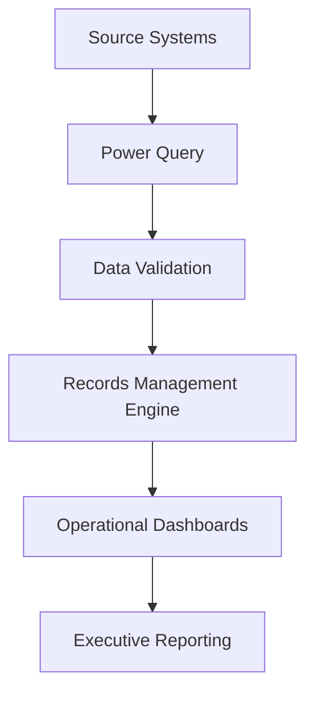
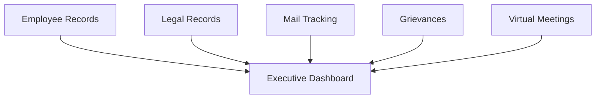

# BA-002-Enterprise-Records-Management-Compliance-System

> Business Analytics Portfolio Series

> Designed and implemented a centralized enterprise records management system that standardized document workflows, automated compliance tracking, and improved operational reporting across multiple detention facilities.

---
# 📊 Project Snapshot

| Category | Details |
|----------|---------|
| Role | Business Analyst / Solution Designer |
| Industry | Detention Operations |
| Primary Skill | Operations Management |
| Secondary Skills | Process Improvement, Compliance, Dashboard Development |
| Primary Tools | Microsoft Excel, Power Query, Advanced Formulas |
| Project Type | Enterprise Records Management |
| Status | Production Implementation |
| Deployment | Alligator Alcatraz & Baker Correctional Institution |

---

# Executive Summary

---

# Operational Environment

---

# Business Problem

---

# Project Objectives

---

# Existing Process

---

# Solution Overview

---

## Solution Workflow

---

# Solution Architecture

---

# System Modules

---

# Data Flow

---

# Dashboard & Reporting

---

# Compliance Controls

---

# Multi-Facility Deployment

## Initial Deployment

- Alligator Alcatraz

## Secondary Deployment

- Baker Correctional Institution

## Standardization Benefits

---

# Technologies Used

- Microsoft Excel
- Power Query
- Advanced Excel Formulas
- Dynamic Arrays
- XLOOKUP
- LET
- FILTER
- COUNTIFS
- Conditional Formatting
- Data Validation
- Dashboard Design

---

# Key Features

---

# Results

---

# Leadership Value

---

# Screenshots

## Executive Dashboard

*(Coming Soon)*

---

## Records Management Dashboard

*(Coming Soon)*

---

## Power Query Workflow

*(Coming Soon)*

---

## Data Validation

*(Coming Soon)*

---

## Operational Reports

*(Coming Soon)*

---

# Lessons Learned

---

# Future Enhancements

---

# Related Projects

- BA-001 | Workforce Planning & Scheduling System
- BA-003 | Executive Dashboard Suite
- BA-004 | Grievance Tracking System
